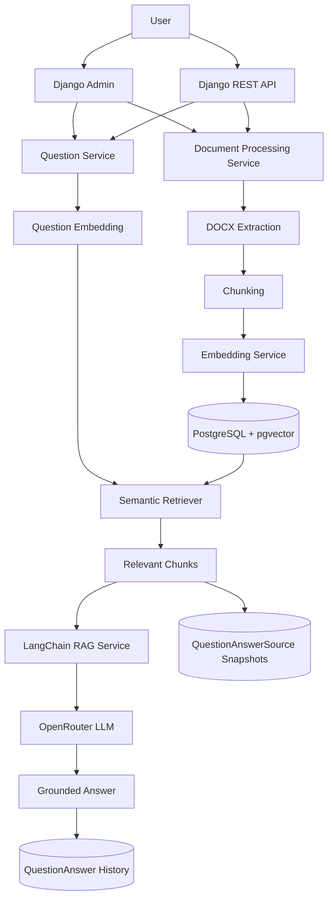
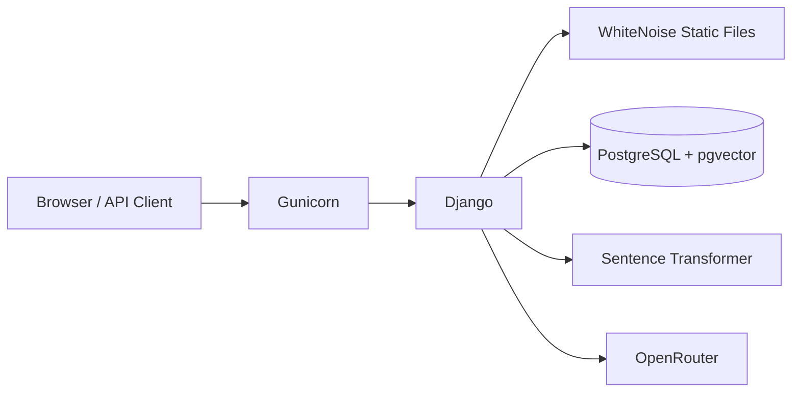

# Architecture

## Overview

Document QA RAG is a Django application implementing a
Retrieval-Augmented Generation pipeline for DOCX documents.

The architecture deliberately keeps infrastructure small:

- Django handles application logic, Admin, and REST APIs.
- PostgreSQL stores application data.
- pgvector stores document embeddings.
- Sentence Transformers generates multilingual embeddings.
- LangChain coordinates the LLM interaction.
- OpenRouter provides the language model.
- Docker Compose runs the local application stack.

## System Diagram



## Django Applications

The project is divided primarily into two applications.

### `apps.documents`

Responsible for:

- document persistence;
- DOCX upload metadata;
- full-text storage;
- extraction;
- chunking;
- embedding generation;
- pgvector indexing;
- semantic retrieval support;
- document REST API;
- document management through Django Admin;
- sample-data management command.

Main data models:

```text
Document
DocumentChunk
```

### `apps.qa`

Responsible for:

- asking questions;
- RAG orchestration;
- LangChain/OpenRouter communication;
- deterministic no-context handling;
- question-answer history;
- answer source snapshots;
- QA API;
- Admin question workflow;
- QA history Admin interface.

Main data models:

```text
QuestionAnswer
QuestionAnswerSource
```

## Document Processing Flow

A newly uploaded document initially contains its file and metadata.

Processing follows:

```text
uploaded
   |
   v
processing
   |
   +--> DOCX extraction
   |
   +--> full text persistence
   |
   +--> chunk generation
   |
   v
processed
   |
   +--> embedding generation
   |
   +--> vector persistence
   |
   v
indexed
```

If processing fails:

```text
failed
```

and the error is stored in:

```text
Document.processing_error
```

## DOCX Extraction

`python-docx` is used to extract textual paragraph content.

The complete extracted text is stored on the `Document` record.

Keeping full text separately from chunks allows:

- document inspection;
- easier debugging;
- later re-chunking;
- future support for alternative retrieval strategies.

## Chunking

The current pipeline uses LangChain text splitting.

Default behavior:

```text
chunk size:    1000 characters
chunk overlap: 200 characters
```

Overlap reduces the chance that information spanning a chunk boundary is
lost during retrieval.

Each chunk stores:

- document relation;
- chunk index;
- text content;
- original start position;
- character count;
- embedding vector.

## Embedding Model

The configured default is:

```text
sentence-transformers/paraphrase-multilingual-MiniLM-L12-v2
```

Embedding dimension:

```text
384
```

The model supports multilingual semantic representations and is suitable
for English/Persian project use.

Embeddings are normalized before persistence.

## Vector Storage

Embeddings are stored directly in PostgreSQL using pgvector.

This avoids introducing another database service and keeps:

- document metadata;
- chunks;
- embeddings;
- QA history;
- source snapshots

inside PostgreSQL.

## Retrieval

Question retrieval follows:

```text
question
   |
   v
question embedding
   |
   v
pgvector cosine distance
   |
   v
cosine similarity
   |
   v
minimum similarity filter
   |
   v
top_k results
```

The retriever only considers:

- documents with `indexed` status;
- chunks with non-null embeddings.

An optional list of document IDs can further restrict retrieval.

Current API limits:

```text
top_k:          1..10
min_similarity: 0.0..1.0
```

## RAG Flow

The RAG service receives retrieved chunks and builds document context for
the language model.

The prompt requires the model to:

- answer from document context only;
- avoid unsupported facts;
- answer in the question's language;
- report insufficient information when necessary.

The model is accessed through LangChain using an OpenRouter-backed chat
model.

## No-Context Behavior

If retrieval produces no chunks above the similarity threshold, the LLM
is not invoked.

For English questions:

```text
The available documents do not contain enough information to answer this question.
```

For Persian/Arabic-script questions, a Persian insufficient-context
response is returned.

This behavior is deterministic.

## Question History

Generated responses are stored in:

```text
QuestionAnswer
```

including:

- question;
- answer;
- `top_k`;
- similarity threshold;
- selected document IDs;
- creation time.

## Source Snapshots

Each retrieved source is persisted in:

```text
QuestionAnswerSource
```

The record contains:

- optional live chunk relation;
- document ID snapshot;
- document title snapshot;
- chunk index;
- similarity score.

The live chunk relation uses `SET_NULL`.

Therefore, if a document is deleted later:

```text
QuestionAnswer
        |
        v
QuestionAnswerSource remains
        |
        +--> chunk = NULL
        +--> document title preserved
        +--> document ID preserved
        +--> similarity preserved
```

This is useful for auditability.

## Django Admin Flow

Django Admin is the required user interface.

It provides:

- document creation;
- document editing;
- file replacement;
- deletion;
- processing/indexing actions;
- chunk inspection;
- QA history inspection;
- source inspection;
- question submission.

A title-only edit does not trigger unnecessary indexing.

Replacing the uploaded file does.

## REST API

The API layer uses Django REST Framework.

Document endpoints provide complete CRUD behavior.

Question endpoints provide:

- question submission;
- persisted history list;
- persisted history detail.

API behavior also includes:

- standardized validation errors;
- standardized 404 and service errors;
- pagination;
- health checking;
- OpenAPI documentation.

## Error Handling

Validation error:

```json
{
  "error": {
    "code": "validation_error",
    "message": "Request validation failed.",
    "details": {}
  }
}
```

Other API error:

```json
{
  "error": {
    "code": "not_found",
    "message": "Resource not found."
  }
}
```

RAG service failures return HTTP `503`.

## Deployment Architecture



Docker Compose runs:

```text
web
db
```

The `web` service uses:

- Gunicorn;
- WhiteNoise;
- Django;
- persistent Hugging Face cache volume.

The `db` service uses:

- PostgreSQL 16;
- pgvector extension;
- persistent database volume.

## Health Check

The application exposes:

```text
GET /api/health/
```

It verifies:

- Django API availability;
- database connectivity.

Docker Compose uses the same endpoint for web-container health.

External LLM availability is intentionally not part of the health check
because health checks should remain fast and deterministic.

## Technical Decisions

### Why PostgreSQL + pgvector?

The application already requires relational persistence. pgvector adds
semantic vector search without a separate vector database.

### Why synchronous indexing?

It keeps the project understandable and removes the operational
complexity of Redis/Celery.

A background queue would be appropriate for large production workloads.

### Why multilingual embeddings?

The project can receive Persian and English content/questions, so one
multilingual embedding space simplifies retrieval.

### Why service modules?

Business logic stays outside Django views and models, improving
testability and readability.

### Why one Gunicorn worker?

Sentence Transformer/PyTorch model state can consume significant memory.
Multiple worker processes could each load their own model.

One worker with multiple threads is sufficient for this project/demo
environment.

## Strengths

- clear separation between application layers;
- persistent source attribution;
- deterministic no-context behavior;
- multilingual retrieval;
- PostgreSQL-native vector storage;
- reusable service layer;
- both Admin and REST interfaces;
- generated API documentation;
- reproducible sample data;
- extensive automated tests;
- container health checking.

## Limitations

- only DOCX is currently supported;
- processing is synchronous;
- no asynchronous task queue;
- no per-user document ownership;
- public REST API has no authentication layer;
- no reranking stage after vector retrieval;
- no hybrid keyword/vector retrieval;
- no OCR or scanned-document processing;
- local filesystem media storage;
- free OpenRouter model availability may change;
- LLM response wording is nondeterministic;
- retrieval quality depends on embedding model, chunking, and thresholds.

These are intentionally visible limitations so future development can
address them explicitly.